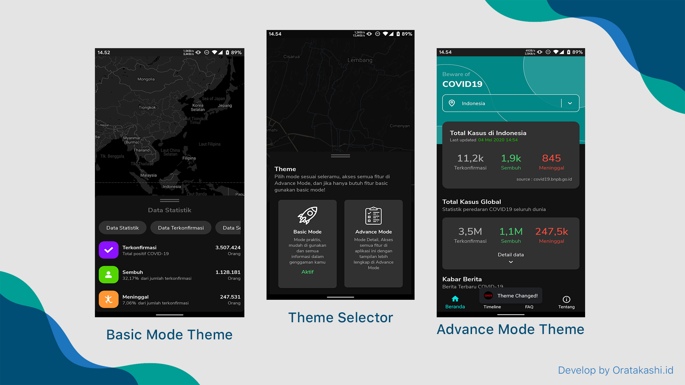
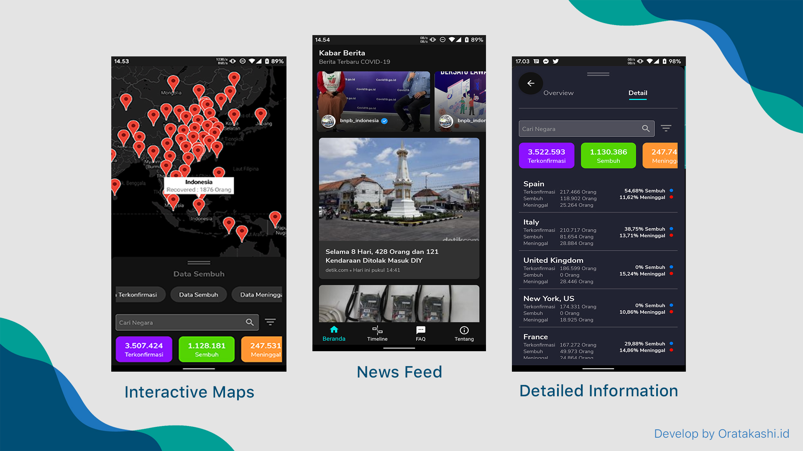

  <a href="#">
		<h1 align="center">COVID19 Tracking Apps</h1>
  </a>

  COVID19 Tracking Apps merupakan project OpenSource yang di kembangkan oleh Oratkashi Nhamako aka Key, seorang software enginering yang sangat senang dengan programming dan ingin berbagi kepada para pelajar / mahasiswa yang baru dan ingin belajar tentang web programming, Project ini free dan open source (Boleh di kembangkan lagi)

 

 

 
Screenshot

 

  

 
Screenshot.

 

 
 <h1>Download Demo</h1>
 https://download.oratakashi.com/covid19tracker.apk
  
 <h1>Creator</h1>
 
COVID19 Tracking Apps is created by [Oratakashi](http://github.com/oratakashi)

 
You can contact me at : oratakashi@oratakashi.com

 <h1>License</h1>
 
COVID19 Tracking Apps is under the [Apache License](LICENSE)

